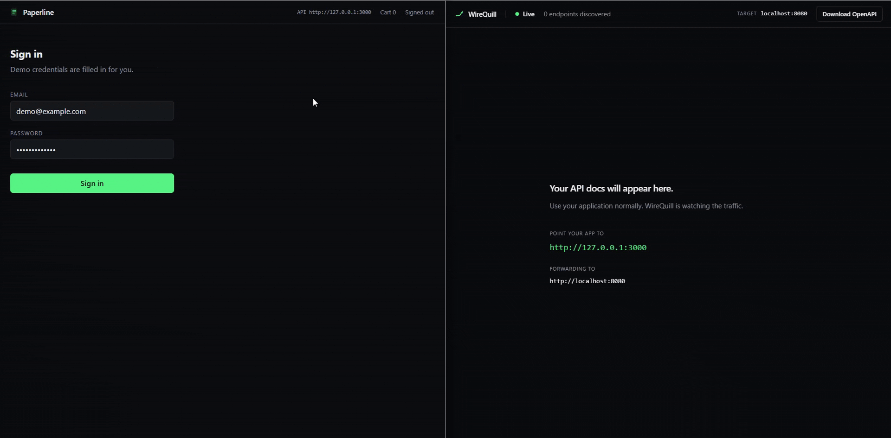

# WireQuill

> **Your API documents itself.**

[](https://github.com/gokhanozgezer/wirequill/actions/workflows/ci.yml)
[](https://www.npmjs.com/package/wirequill)
[](https://github.com/gokhanozgezer/wirequill/releases)
[](./LICENSE)
[](https://nodejs.org/)

WireQuill watches real HTTP traffic and turns it into **live OpenAPI documentation**.

No handwritten OpenAPI.
No annotations.
No account.
No cloud.

```powershell
npx wirequill --target http://localhost:8080
```

Then point your application to:

```text
http://127.0.0.1:3000
```

and open:

```text
http://127.0.0.1:3001
```

Use your application normally.

**The docs appear as the traffic happens.**

Add the real launch demo when it is captured:

<p align="center">
  
</p>

---

## What it looks like

```text
Your App
   │
   ▼
WireQuill :3000
   │
   ├── observes HTTP traffic
   ├── discovers endpoints
   ├── infers request/response schemas
   ├── redacts common secrets
   └── generates OpenAPI 3.1
   │
   ▼
Backend :8080

Live Docs → localhost:3001
```

WireQuill sits between your client and backend as a local reverse proxy.

You keep using your application.

WireQuill learns the API from the traffic it actually sees.

---

## Why WireQuill?

API documentation usually asks developers to describe what an API **should** do.

WireQuill observes what the API **actually does**.

Instead of maintaining annotations or a handwritten OpenAPI file:

```text
Run WireQuill
     ↓
Use your app
     ↓
Docs appear
```

---

## Quick start

### 1. Start your backend

For example:

```text
http://localhost:8080
```

### 2. Start WireQuill

```powershell
npx wirequill --target http://localhost:8080
```

WireQuill starts:

```text
Proxy    http://127.0.0.1:3000
Target   http://localhost:8080
Docs     http://127.0.0.1:3001

● Watching API traffic...
```

### 3. Point your app to the proxy

Before:

```env
VITE_API_URL=http://localhost:8080
```

With WireQuill:

```env
VITE_API_URL=http://127.0.0.1:3000
```

Now use your application normally.

Open:

```text
http://127.0.0.1:3001
```

and watch your API documentation appear live.

---

## What WireQuill discovers

Given traffic like:

```http
GET /products/123
```

WireQuill can infer:

```text
GET /products/{productId}
```

with a path parameter:

```yaml
productId:
  in: path
  required: true
  schema:
    type: integer
```

Given a response:

```json
{
  "id": 123,
  "name": "Mechanical Keyboard",
  "price": 129.99,
  "available": true
}
```

WireQuill can infer a schema like:

```yaml
type: object

properties:
  available:
    type: boolean

  id:
    type: integer

  name:
    type: string

  price:
    type: number
```

As more traffic is observed, the generated contract is updated.

---

## Live documentation

WireQuill generates an OpenAPI 3.1 document and renders it locally using a polished API reference interface.

The page updates through live events when the public API contract changes.

No manual refresh required.

```text
0 endpoints
     ↓
Sign in
     ↓
1 endpoint
     ↓
Browse products
     ↓
2 endpoints
     ↓
Open a product
     ↓
3 endpoints
     ↓
Add to cart
     ↓
4 endpoints
     ↓
Checkout
     ↓
5 endpoints
```

---

## OpenAPI

The generated specification is available at:

```text
http://127.0.0.1:3001/openapi.json
```

You can also use the **Download OpenAPI** button in the documentation interface.

WireQuill generates:

- paths
- HTTP methods
- path parameters
- query parameters
- custom headers
- request schemas
- response schemas
- response status codes
- observed media types
- authentication schemes
- redacted examples

---

## Local by default

WireQuill is designed to run on your machine.

```text
✓ No account
✓ No cloud service
✓ No telemetry
✓ No hosted database
✓ No traffic upload
```

The documentation server binds to:

```text
127.0.0.1
```

by default.

Your captured API traffic is not uploaded to a WireQuill service.

There is no WireQuill cloud service in v0.1.

---

## Secret redaction

WireQuill uses real API traffic, so privacy is treated as part of the core architecture.

Common sensitive values are sanitized before documentation examples are persisted.

For example:

```json
{
  "email": "demo@example.com",
  "password": "demo-password"
}
```

becomes:

```json
{
  "email": "[REDACTED]",
  "password": "[REDACTED]"
}
```

And:

```json
{
  "access_token": "secret-token",
  "user": {
    "id": 42,
    "email": "demo@example.com"
  }
}
```

becomes:

```json
{
  "access_token": "[REDACTED]",
  "user": {
    "id": 42,
    "email": "[REDACTED]"
  }
}
```

WireQuill also protects common sensitive:

- authorization headers
- cookies
- API keys
- access tokens
- refresh tokens
- passwords
- private keys
- sensitive query parameters
- credential-like path segments

### Important

Automatic redaction is **best-effort**, not a formal DLP system.

Review generated documentation before publishing it externally.

---

## Schema inference without storing raw values

WireQuill separates structural inference from persisted examples.

Conceptually:

```text
Raw value
   │
   ├── infer type / structure in memory
   │
   └── redact value
          │
          ▼
     safe persisted state
```

This means a value such as:

```json
{
  "cvv": 123
}
```

can still be documented as:

```yaml
cvv:
  type: integer
```

even though the stored example is:

```json
{
  "cvv": "[REDACTED]"
}
```

The schema evidence stores structural information and observation counts — not the original body values.

---

## Conservative inference

WireQuill intentionally avoids pretending that observed traffic reveals every server-side validation rule.

It does **not** infer arbitrary:

- enums
- regex patterns
- numeric minimums or maximums
- string length limits
- closed-object constraints

from a few runtime samples.

For example, observing:

```json
{
  "role": "admin"
}
```

does **not** cause WireQuill to generate:

```yaml
enum:
  - admin
```

The goal is useful runtime documentation without inventing constraints that were never observed.

---

## Supported body types

### Analyzed

- `application/json`
- `application/*+json`
- `application/x-www-form-urlencoded`

### Passed through, but not deeply documented

- `multipart/form-data`
- binary bodies
- images
- video
- audio
- PDF
- `text/plain`
- server-sent event bodies

WebSocket connections can pass through the proxy, but WebSocket messages are not documented in v0.1.

---

## HTTPS backends

HTTPS upstream targets are supported:

```powershell
npx wirequill --target https://localhost:8443
```

For a local backend using a self-signed certificate:

```powershell
npx wirequill `
  --target https://localhost:8443 `
  --insecure
```

WireQuill will explicitly warn when TLS verification is disabled.

---

## Options

```text
--target <url>        Upstream backend URL
--port <number>       Proxy port
--docs-port <number>  Documentation port
--host <host>         Proxy bind host
--config <path>       Configuration file
--db <path>           SQLite database path
--max-body <bytes>    Per-body capture limit
--insecure            Allow invalid upstream TLS certificates
--no-open             Do not automatically open the docs
--verbose             Show additional diagnostics
--version
--help
```

Defaults:

```text
Proxy     127.0.0.1:3000
Docs      127.0.0.1:3001
```

---

## Configuration file

WireQuill can also use:

```text
wirequill.config.json
```

Example:

```json
{
  "target": "http://localhost:8080",
  "proxy": {
    "host": "127.0.0.1",
    "port": 3000,
    "insecure": false
  },
  "docs": {
    "port": 3001,
    "title": "Acme API",
    "openBrowser": true
  },
  "capture": {
    "maxBodyBytes": 1048576
  },
  "inference": {
    "requiredAfterSamples": 3
  }
}
```

Configuration precedence:

```text
CLI
 ↓
Environment variables
 ↓
wirequill.config.json
 ↓
Defaults
```

---

## Try the demo

WireQuill includes a small local demo store designed to show the complete flow.

From the repository:

```powershell
pnpm demo
```

Then start WireQuill:

```powershell
npx wirequill --target http://localhost:8080
```

Open:

```text
Demo Store
http://127.0.0.1:5173

WireQuill Docs
http://127.0.0.1:3001
```

The demo generates this sequence:

```text
Sign in
  ↓
POST /auth/login

Browse products
  ↓
GET /products

Open a product
  ↓
GET /products/{productId}

Add to cart
  ↓
POST /cart/items

Checkout
  ↓
POST /checkout
```

The documentation starts at zero and builds as you use the store.

### Resetting the demo

Stop WireQuill first.

Then:

```powershell
pnpm demo:reset
```

The reset command intentionally refuses to clear the demo workspace while WireQuill is still running.

---

## What WireQuill is not

WireQuill v0.1 is not:

- a production API gateway
- an observability platform
- a load tester
- a fuzzing tool
- an API client
- a hosted documentation service
- an AI agent

It is a development-time tool for generating documentation from real API behavior.

---

## Current limitations

WireQuill only knows what it has observed.

That means:

- unobserved endpoints are not documented
- unobserved response codes are not documented
- generic string/slug routes are inferred conservatively
- multipart request bodies are not deeply parsed
- WebSocket messages are not documented
- GraphQL-aware operation analysis is not included
- secret redaction is best-effort

See [`docs/LIMITATIONS.md`](docs/LIMITATIONS.md) for details.

---

## Requirements

```text
Node.js 24+
```

WireQuill is tested primarily on:

- Windows 11
- Linux
- macOS

Native Windows + PowerShell is a first-class supported development environment.

---

## Development

Install dependencies:

```powershell
pnpm install
```

Run verification:

```powershell
pnpm format:check
pnpm lint
pnpm typecheck
pnpm test:unit
pnpm test:integration
pnpm test:e2e
pnpm test:package
pnpm build
```

---

## Project layout

```text
apps/
  docs-ui/           Live documentation interface

packages/
  wirequill/         CLI, proxy, inference, OpenAPI and docs server

examples/
  demo-store/        Local launch/demo application

docs/
  PRIVACY.md
  LIMITATIONS.md
  DECISIONS.md
```

---

## Roadmap

WireQuill v0.1 intentionally focuses on one workflow:

```text
Traffic → OpenAPI → Live Docs
```

Possible post-launch directions include:

- richer documentation enrichment
- API contract diffing
- request replay
- runtime-derived fuzzing
- local mock workflows

No dates are promised.

The core local-first experience comes first.

---

## Security

If you believe you found a security issue, please follow [`SECURITY.md`](SECURITY.md).

Do not include:

- API keys
- passwords
- tokens
- cookies
- private payloads

in public issues.

---

## Contributing

Contributions are welcome.

See [`CONTRIBUTING.md`](CONTRIBUTING.md).

---

## License

WireQuill is licensed under the **Apache License 2.0**.

See [`LICENSE`](LICENSE) and [`NOTICE`](NOTICE).

The software license does not grant general rights to the WireQuill name or logo.

---

<p align="center">
  <strong>Stop writing API docs. Just use your app.</strong>
</p>
